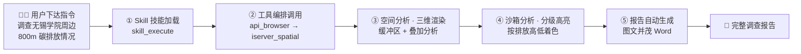
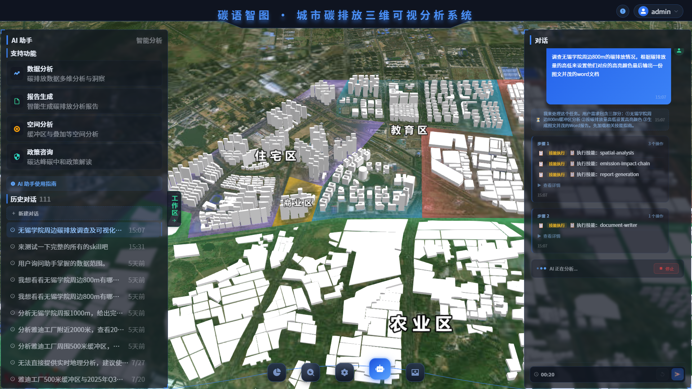
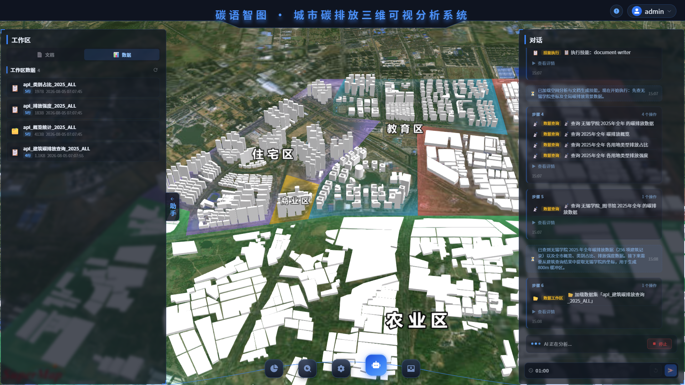
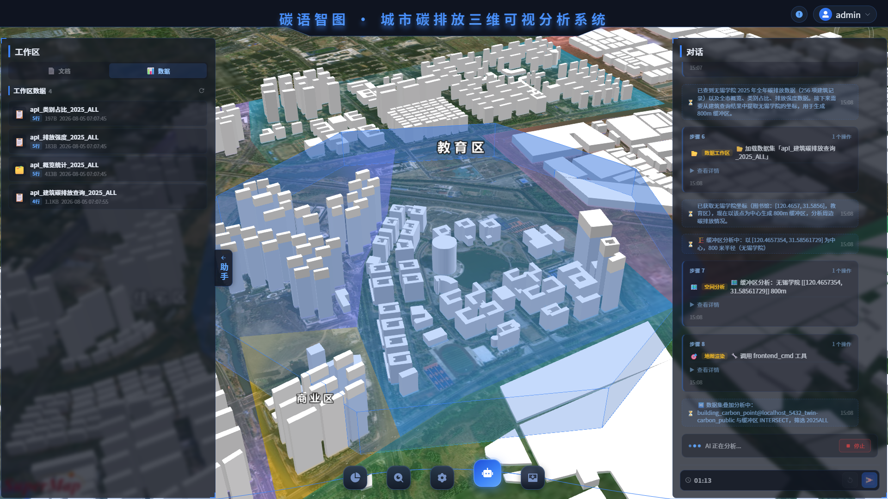
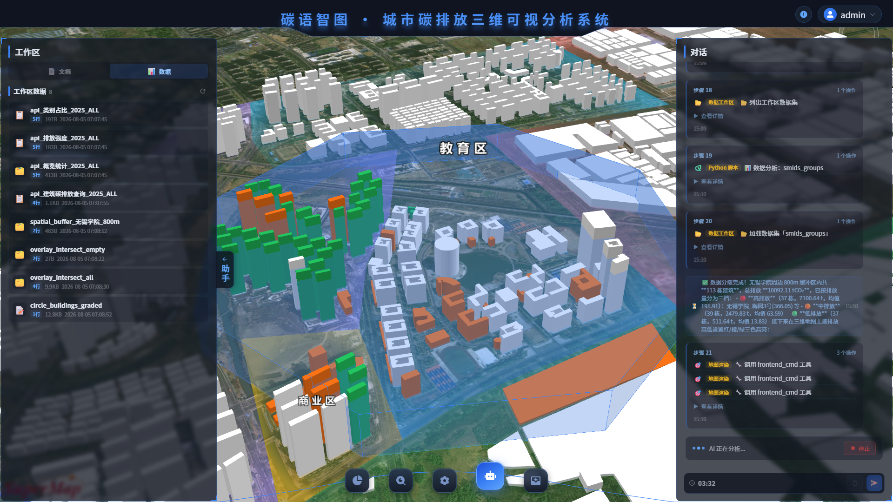
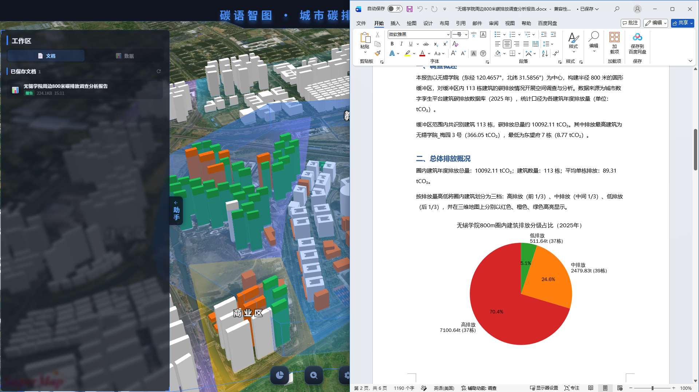

# 碳语智图 · 城市碳排放三维可视分析系统（前端）

> 📌 **本文档旨在展示系统的 AI-Agent 功能**，其余内容从简。

前端是 **AI-Agent 空间分析演示** 的核心载体：基于 Vue 3 + Cesium + ECharts 构建，通过 SSE 实时接收 Agent 执行过程，将**技能加载、工具调用、空间分析、分级高亮与报告生成**完整呈现于三维场景。

<div align="center">


</div>

---

## 演示总览：AI-Agent 空间分析全链路

前端围绕一条完整的智能分析叙事展开 —— 以"**调查无锡学院周边 800m 范围内的碳排放情况**"为例，Agent 自动完成从技能加载到报告输出的全链路：



> 📷 **截图占位**：依次运行以下 5 个演示步骤，截图保存到 `docs/images/` 对应文件名即可替换。

---

## ① Skill 技能加载

用户下达调查指令后，Agent 先通过 `skill_execute` 加载匹配的空间分析技能文档，前端实时展示**技能加载过程**（技能名称、触发词、执行步骤）。

<!-- ⬇️ 截图占位 -->
<p align="center">
  
  <br/>
  <sub>图 1 Skill 技能加载（Agent 识别空间分析任务并加载技能）</sub>
</p>

---

## ② 工具编排调用

Agent 按技能步骤依次调用工具：`api_browser` 查询无锡学院精确坐标 → `iserver_spatial` 生成 800m 缓冲区。前端右侧面板**实时滚动展示工具调用轨迹**（工具名、参数、耗时、执行结果），让智能体的决策过程全程透明。

<!-- ⬇️ 截图占位 -->
<p align="center">
  
  <br/>
  <sub>图 2 工具编排调用（工具调用轨迹实时展示）</sub>
</p>

---

## ③ 空间分析 · 三维渲染

`iserver_spatial` 完成缓冲区生成与数据集叠加分析（缓冲区 ∩ 建筑数据），`frontend_cmd` 将结果**渲染到 Cesium 三维场景**：800m 缓冲区边界 + 落入范围内的建筑清晰标出。

<!-- ⬇️ 截图占位 -->
<p align="center">
  
  <br/>
  <sub>图 3 空间分析与三维渲染（800m 缓冲区 + 范围内建筑）</sub>
</p>

---

## ④ 沙箱分析 · 分级高亮

`exec_sandbox` 运行 Python 对范围内建筑**按碳排放量高低分级**，`frontend_cmd` 将分级结果**以不同颜色高亮到三维场景** —— 排放量高 → 红色、中等 → 橙色、低 → 绿色，直观呈现碳排放的空间分布。

<!-- ⬇️ 截图占位 -->
<p align="center">
  
  <br/>
  <sub>图 4 沙箱分析与分级高亮（红 = 高排放 / 橙 = 中等 / 绿 = 低排放）</sub>
</p>

---

## ⑤ 报告自动生成

`document` 工具汇总分析结果，结合联网检索的双碳政策，自动生成**图文并茂的 Word 调查报告**。右侧 `DocumentsPanel` 支持**在线预览与下载**，一次调查即产出可直接使用的专业报告。

<!-- ⬇️ 截图占位 -->
<p align="center">
  
  <br/>
  <sub>图 5 报告自动生成（图文并茂的 Word 调查报告预览）</sub>
</p>

---

## 技术栈

| 类别 | 技术 | 版本 |
|------|------|------|
| 框架 | Vue 3（Composition API + `<script setup>`） | 3.5 |
| 构建 | Vite | 6.0 |
| 路由 / 状态 | Vue Router（Hash）/ Pinia | 4.5 / 3.0 |
| UI 组件 | Element Plus | 2.14 |
| 图表 | ECharts | 6.0 |
| 三维 GIS | Cesium（SuperMap iClient 定制版，本地 `public/Cesium/` 引入） | — |
| 大屏适配 | autofit.js | 3.2 |
| 文档预览 | docx-preview + marked | — |
| 动画 | GSAP | 3.13 |

---

## 快速开始

```bash
npm install     # 安装依赖
npm run dev     # 启动开发服务器（默认 5173）
```

访问 <http://localhost:5173/twin-carbon/>（账号 `admin` / `123456`）。

前置依赖：后端 `twin-carbon-boot`（`localhost:8080`）+ iServer（`localhost:8090`），环境变量见 `.env`。生产构建：`npm run build`。

---

## 项目结构（Agent 相关）

```
src/
├── api/agent.js                 # Agent API：SSE 流式对话 / pending-render 轮询
├── vue/pages/Dashboard/
│   ├── dashboard.vue            # 主布局 + Cesium 初始化 + 空间分析渲染
│   ├── panel/AIAgentLeft.vue    # AI 对话面板（流式输出 + 意图展示）
│   ├── panel/AIAgentRight.vue   # 工具调用轨迹 / 进度步骤展示
│   └── panel/DocumentsPanel.vue # 报告预览与下载
└── js/
    ├── stores/useConfigStore.js # 渲染指令队列 / 主相机状态
    └── utils/heatmap3D.js       # 三维热力图工具
```

**Agent 前端渲染闭环**：后端 FC 循环写渲染队列 → SSE `render_command` 实时推送 → 前端 `useConfigStore` 消费 → Cesium `flyTo` 自适应定位 + 建筑高亮。

---

## 部署

Docker + Nginx 容器化部署（见根目录 `deploy/` 部署包）：`docker compose up -d --build frontend`，路径前缀 `/twin-carbon/`。

---

## 许可证

本项目基于 Apache License 2.0 开源，详见 [LICENSE](./LICENSE)。
